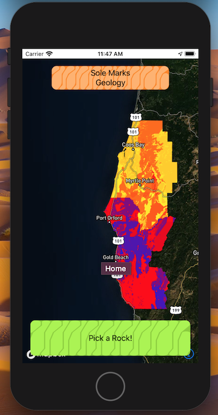
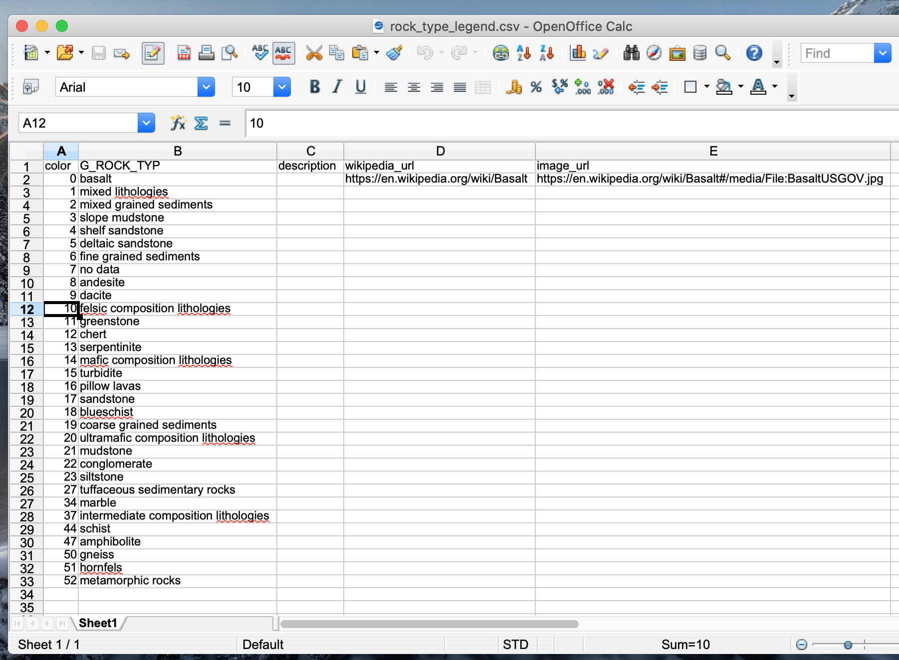
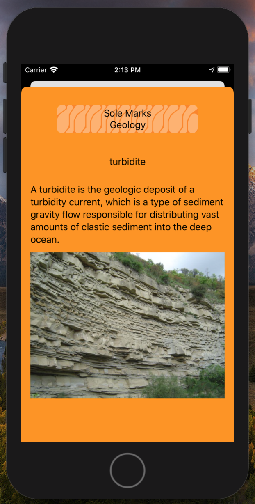
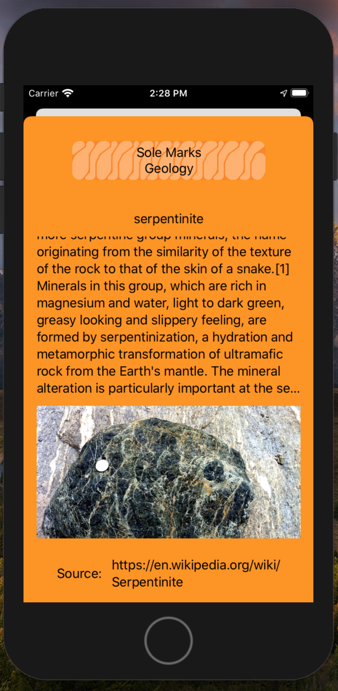

# map675-module-05-once-aday-assignment-05


## Table of Contents
- [Webpack, React and Map Experimentation](#webpack-react-and-map-experimentation)
- [Create React App - Sole Geology](#create-react-app---sole-geology)
- [Create iOS App - Sole Geology](#create-ios-app---solegeology)


## Webpack, React and Map Experimentation

I'm beginning by getting more familiar with webpack. Below are some notes as I am going through the process of building an app according to starter documentation..

https://webpack.js.org/guides/

I'm saving the webpack-demo project in my https://github.com/newmapsplus/map675-module-05-once-aday repository.

<h4>Installing custom fonts</h4>

In order to use a ttf type font I had to specifically use it's format handler within my style.css file:

`src:  url('./Ranchers-Regular.ttf') format("truetype");`

Support for loading in JSON data from file is built in like so in index.js:

// No warning
import data from './data.json';

<h3>React and Mapping</h3>

React uses webpack and a host of other npm packages to initialize and run.

I'm going through a number of mapbox examples to determine the different ways to integrate web maps with react:

https://github.com/mapbox/mapbox-react-examples

The "Basic" example:

Index.js appears to be the entry Point for the npm start script.
The ReactDOM element renders the App.js function from './app' directory and then calls the 'root' element in the DOM:

```
import App from './App';

ReactDOM.render(
  <React.StrictMode>
    <App />
  </React.StrictMode>,
  document.getElementById('root')
);
```

App.js renders the Map by calling Map from Map.js. So the process so far to get to the map is Index > App.js > Map.js. The only item that is called within App.js is the Map so that Map is all we see on the final homepage.

```
function App() {
  return (
    <div>
      <Map />
    </div>
  );
}

export default App;
```
Map.js has two main sections: The building of the Map and it's configuration. They are contained within a:
 `const Map = () => {}`
object, and the HTML of how to visually render the map is represented inside a return() statement containing div elements.

There is a useEffect function that initializes the map when the component mounts. Within useEffect is all the typical Mapbox GL JS code to start a new map. The config for zoom, tiles, navigation controls, mouse movements, etc. is all here.  There is a return statement within useEffect that is called when the map component is unmounted:
`return () => map.remove();`

The information box that has the coordinates display for the UI is styled within a .css file, map.css, which is imported in the beginning of Map.js:

`import './Map.css';`

So any div's that are called within in the component can be styled based on the css from that file. Here the div className='sidebarStyle' and div className='map-container' ref={mapContainerRef} are styled using the css from Map.css:

```
.map-container {
  position: absolute;
  top: 0;
...
}

.sidebarStyle {
  display: inline-block;
...
}
```

<h3>Data overlay example</h3>

The package.json is similar in this example to the basic examples.

It follows the same structure. Index.js > App.js > Map.js

Within the const map object there is an array of options containing Mapbox Expressions (with data-driven class break stops/colors ) styling rules as well as identifiers for different map layers.

There is a `const [active, setActive] = useState(options[0]);` declaration. This appears to be what is monitored by the app to trigger changes to the layer styling.

A single layer, countries, is added to the map when it appears. Based on which option (from the options array) is active, the layer is restyled (using the mapbox gl js setPaint method) based on the rules given.

There is a Paint object `const paint = () => {}` that ensures the paint stylings of the map layer are always set to the active option (from the options array).

There is a `const changeState = i => {}` object that tells the component what to do when changeState is called.

changeState is baked into the functionality of the HTML/UI of Map.js. When you click on the OptionsField component (this is an HTML UI element/component and is in a seperate file, 'components/Optionsield.js')
Optionsfield.js is similarly structured as Map.js. It has a const `const Optionsfield = (props) => {` object and also returns some HTML/UI code to render.

  From Map.js when optionsField is called in the HTML:

  ```
  <Optionsfield
        options={options}
        property={active.property}
        changeState={changeState}
        />
  ```

In this case the optionsField is passed the current properties of the map layer (the state) and can execute the ChangeState function/code from within itself.

The optionsfield.js component returns a togglebox interface with connections to the state of the map and the ability to run changeState() when the button is toggled.

Note: The end of optionsfield.js has a `export default Optionsfield;` line that seems to be pretty standard for each unique component file.

So all in all the code is complex but the components are fairly self contained and modular.

The Legend.js component is also dynamically populated and styled. It takes the active option data and renders it on the map:
`<Legend active={active} stops={active.stops} />`


<h3>React powered tooltip</h3>


So are the App.js and Map.js calls to render the map.

App.js
Map.js

## Create React App - Sole Geology

I am going to try taking what I learned from the mapbox examples above and create an app to display Oregon Geology in a React app, using the "create react-app" starter from:

https://reactjs.org/docs/create-a-new-react-app.html#create-react-app

Earlier this week I was experimenting with the mapbox iOS SDK and was able to get a basic geologic map and tap on feature functionality working on my iPhone. Here I'll try to create a companion React web page with similar functionality to the app. It will also serve to encourage people to download the app.

<h4>Initial Setup</h4>
`npx create-react-app sole-geology`
`npm install mapbox-gl`

I was able to take the create-react-app template and merge in some of the code from the "basic" example from the mapbox react examples repository.

 A simple map with a zoom control is now present with the other create-react app homepage boilerplate. The Map appears to display on top of the starter UI that came with create-react app.


Add Geo-locate controls
`map.addControl(new mapboxgl.GeolocateControl(), 'top-left')`


Note: Official USGS Geology color guide + Other color resources:
https://pubs.usgs.gov/tm/2005/11B01/05tm11b01.html
https://www.oregongeology.org/geologicmap/geologic-map-of-Oregon-legend.pdf
https://www.oregongeology.org/pubs/dds/p-OGDC-6.htm

<h3>position geology under roads on basemap</h3>

I can specify the lowest symbol layer in the mapbox style when I add the geology layer, this will position the geology layer right below that.

```
map.addLayer(
  {
    id: 'geology-layer',
    type: 'fill',
    source: 'geology'
  },
  'tunnel-street-minor-low');
  ```
https://docs.mapbox.com/mapbox-gl-js/api/map/#map#addlayer

Note: It is also possible to do this dynamically:
https://docs.mapbox.com/mapbox-gl-js/example/geojson-layer-in-stack/

<h3> Implement custom package Info-box</h3>

https://github.com/el/infobox-control

The info box package successfully works when I set it up like so:

```
const layerId = "geology-layer";
const formatter = properties => properties ? `<b>Rock Type:</b> ${properties['G_ROCK_TYP']}` : '';
const infoboxOptions: MapboxInfoBoxOptions = {
    layerId,
    formatter
};
map.addControl(new MapboxInfoBoxControl(infoboxOptions));
```

A react project was the ideal application to utilize a package like infobox-control. It basically does what I want but the styling is defintely not how I'd like it. I will have to decide if I want to keep this package long-term in my app. For now though, it gets the job done and display the rock type when on mouse hover.

Hooks - State:

The official Mapbox react examples make use of state hooks to monitor and execute changes to map layer options:

https://reactjs.org/docs/hooks-state.html

```
const [active, setActive] = useState(options[0]);
const [map, setMap] = useState(null);
```

Hooks - Effect:

Mapbox uses this for rendering the initial map, as well as executing the paint() function which will restyle a layer.

https://reactjs.org/docs/hooks-effect.html

These hooks seem to replace the old paradigm of mounting components. Components are still relevant but not necessary in all cases.

"Instead of thinking in terms of “mounting” and “updating”, you might find it easier to think that effects happen “after render”. React guarantees the DOM has been updated by the time it runs the effects."

Cleaning up effects:

"For example, we might want to set up a subscription to some external data source. In that case, it is important to clean up so that we don’t introduce a memory leak!"

<h3>Material-ui</h3>

I experimented with material-ui and implimented a header App Bar in the  'material-ui top app bar and new page design' commit.

I was considering removing Material-ui because I didn't like the app bar at first but ended up keeping it..

<h4>Material Grids</h4>
There may be some other aspects of material UI I do want to use besides the app bar, making it a more valuable package than I first thought. I noticed there is a grid component in a different React app i sampled. I am going to try to impliment this grid so I can have the Map and my Description text side by side.

https://material-ui.com/components/grid/

<h3>Deploying the app with Surge</h3>

I am going to try and deploy the app to the web using Surge.

https://surge.sh/help/getting-started-with-surge

In order to get surge to work I had to:

npm run build

and then run surge from that build directory

Success..!:

http://freezing-lettuce.surge.sh/

<h4>Basic Styled Component Button</h4>

I implemented the styled component button example. It's a red gradient button that would eventually link to the iOS app download page.

https://material-ui.com/styles/basics/

## Create iOS App - SoleGeology

This React web page was modeled as a companion to an app that similarly will identify basic geology for the user.

I worked on the app last week and have it generating an artistically wild looking card with the rock type displayed when you tap on a geologic unit on the map. When you tap the card a native iOS Sheet will pop up and provide additional information.

Right now the sheet is hardcoded to show details on the rock "Dacite" and an image of the rock.

I am hoping I can render all of this information from the GeoJSON Dataset and avoid having to make any sort of API or database to maintain this information. Potentially I could host all of this out of Mapbox Studio. This would simplify things a great deal so I wouldn't need a backend to worry about.

<a href="url"></a>
<a href="url"></a>
<a href="url"></a>


The design is pretty unruly, I am going to see how difficult it would be to use Material-ui within the iOS app, and replace the card view I have with a material design card..

https://github.com/material-components/material-components-ios/tree/develop/components

After looking through the material design ios code base I think I will hold off on trying to add it to the App, since I already have a working card-like display I will try to restyle it on my own using native styling tools. It's probably better to not overcomplicate the app at this point!

<h3>iOS App General Structure</h3>

This app has three main views:
 - The Map
 - The Info-box when you tap on a rock type
 - The Sheet that pops-up when you tap on the info-box.

 ContentView.swift is the "head" of the monster. All other views are children of this view.

 The map is initiated with `var soleMap = MapView()` and then executed in the view by calling `self.soleMap`.

 ```
 struct ContentView: View {
    @EnvironmentObject var geologyFeatureModel:geologyFeatureModel
    var soleMap = MapView()

    var body: some View {
        GeometryReader { geometry in
            ZStack() {
                self.soleMap
                VStack() {
                  ......
```

 soleMap is an instance of MapView() which you can find in the MapView.swift file.

 MapView.swift holds most of the functions that are called when the user interacts with the map. Including the Gesture Recognizer which will detect taps to the map, then run a function determine which rock type is selected, and update the info-box (aka SelectionResultWindow) with that rock type:

 ```
 @objc @IBAction func handleMapTap(sender: UITapGestureRecognizer) {
        // Get the CGPoint where the user tapped.
            let spot = sender.location(in: control.mapView)
            print(spot)

        // Access the features at that point within the state layer.
            let features = control.mapView.visibleFeatures(at: spot, styleLayerIdentifiers: Set(["geology-layer"]))

        // Get the name of the selected rock.
        if let feature = features.first, let value = feature.attribute(forKey: "G_ROCK_TYP") as? String {
            print(value)
            control.geologyFeatureModel.updateSelectedGeology(selectedGeology: value)
//            control.geologyFeatureModel.updateSelectedGeology(selectedGeology: value)
            } else {
                print("No Feature found")
            control.geologyFeatureModel.activeSelection = false
            }
        }
```

The geologyFeatureModel is the other piece to the puzzle. This model is an observable object that keeps track of which rock type is selected. When the model is initiated the selectedGeology variable is a blank string. When a map tap occurs and a geologic rock type is found (using the model's updateSelectedGeology() function) the selectedGeology variable is updated to be that rock type:

```
class geologyFeatureModel:ObservableObject {
    @Published var selectedGeology:String
    @Published var activeSelection:Bool

    init() {
            selectedGeology = ""
            activeSelection = false
        }
    func updateSelectedGeology(selectedGeology:String)
    {
        self.selectedGeology = selectedGeology
        print("Updated Selected Geology To: \(self.selectedGeology)")
        self.activeSelection = true
    }
}
```

Because the geologyFeatureModel is an environment variable, initially declared with ContentView() it's value is shared throughout the entire app. This allows the app to know what rock type is selected at all times and makes it simpler to update things like the rock type description sheet. Because the app is fairly simple sharing this environment variable, more or less globally, overworking the CPU or memory shouldn't be much of a concern.

```
struct ContentView: View {
    @EnvironmentObject var geologyFeatureModel:geologyFeatureModel
    ....
```

<h2> User Location, Info-box Styling, and Rock Descriptions/Images </h2>

These are the three main new features I am going to be implementing next..

Adding user location is an essential aspect of the app so I'll start there.

This was as simple as adding these two lines of code into MapView.swift:

<a href="url"></a>

```
control.mapView.userTrackingMode = .follow
control.mapView.showsUserHeadingIndicator = true
```

For info-box styling harder corners, and a drop shadow might look nice.

For the rock descriptions I will want to update the underlying GeoJSON to have descriptions for each rock type, as well as an attribute linking to an external URL for the rock's Image. I will see if I can link to the wikipedia URLs for this.

For the rock descriptions; I will need to go rock by rock and grab the descriptions and images from wikipedia. I'll add them to a spread sheet so that I can maintain a good database of this information. Then later if I either update the GeoJSON, or the description data, I can do a simple join by attribute to get that information back into the layer.

<a href="url"></a>

Notes on using data from Wikipedia:

https://en.wikipedia.org/wiki/Wikipedia:Reusing_Wikipedia_content

-	It seems like I can use Wikipedia Text as long as I provide a hyperlink to a stable online copy (the Wikipedia page itself)
-	Must contain a licensing notice: Stating that the work is released under CC-BY-SA and either a) a hyperlink or URL to the text of the license or b) a copy of the license. For this purpose, a suitable URL is: http://creativecommons.org/licenses/by-sa/3.0/

Because of the above rules I am also going to include a wikipedia_url attribute in my dataset.

Eventually I'll probably want some sort of API to automatically pull the data from Wikipedia or some other source. At the very least link to wikipedia.

Potentially I could also contact a publisher of a geologic dictionary and ask to partner with them on this..?

Now that the .csv is all filled out I need to join it's data to my geojson file. Both the .csv and the GeoJSON have their rock type's identified so I should be able to join using that as a primary key.

Mapshaper is a great tool for this job:

https://github.com/mbloch/mapshaper/wiki/Command-Reference#-join

```
Devins-MBP:data devin$ mapshaper all_geology_num.json -join rock_type_legend.csv keys=G_ROCK_TYP,G_ROCK_TYP fields=descr
iption,image_url,wikipedia_url -o geology_descrip.json
[join] Auto-detected number field: color
[join] Joined data from 32 source records to 53 target records
[o] Wrote geology_descrip.json
```

I am only keeping the fields from the .csv that are not already in the GeoJSON file (all_geology_num.json).

```
Devins-MBP:data devin$ mapshaper geology_descrip.json -info
[info]
==================================================
Layer:    geology_descrip
--------------------------------------------------

Type:     polygon
Records:  53
Bounds:   -124.56675190889058,41.995582402000025,-123.70206596799994,43.611462489000075
CRS:      +proj=longlat +datum=WGS84
Source:   geology_descrip.json

Attribute data
---------------+----------------------------------
 Field         | First value
---------------+----------------------------------
 color         | 0
 description   | 'Basalt is a mafic extrusive igneous rock formed from the rapid cooling of lava rich in magnesium and i
ron[5] exposed at or very near the surface of a terrestrial planet or a moon.[6] More than 90% of all volcanic rock on E
arth is basalt,[7] and the eruption of basalt lava is observed by geologists at about 20 volcanoes per year.[8]'
 G_ROCK_TYP    | 'basalt'
 image_url     | 'https://en.wikipedia.org/wiki/Basalt#/media/File:Szentgy%C3%B6rgyhegy03.jpg'
 wikipedia_url | 'https://en.wikipedia.org/wiki/Basalt'
---------------+----------------------------------
```

Next I will upload this to mapbox and replace the old dataset. After that I should have access to all of the new rock description and image data.

Previously the iOS sheet had the hardcoded Dacite description:

```
.sheet(isPresented: self.$showingResultDetail) {
                            selectionResultDetail(descriptionText: "Dacite ( /ˈdeɪsaɪt/) is an igneous, volcanic rock. It has an aphanitic to porphyritic texture and is intermediate in composition between andesite and rhyolite. The word dacite comes from Dacia, a province of the Roman Empire which lay between the Danube River and Carpathian Mountains (now modern Romania and Moldova) where the rock was first described.", selectionName: self.currentSelectionValue)
                            .background(Color.orange)
```

Now I will try and dynamically pull that information from the GeoJSON Tileset hosted on mapbox.

First I need to update the geologyModel to handle additional variables for the new attributes:

```
  ...
@Published var selectedGeologyDescription:String
@Published var selectedGeologyImageURL:String
    ...

func updateSelectedGeology(selectedGeology:String, selectedGeologyDescription:String, selectedGeologyImageURL:String)
    {
        self.selectedGeology = selectedGeology
        self.selectedGeologyDescription = selectedGeologyDescription
        self.selectedGeologyImageURL = selectedGeologyImageURL
        print("Updated Selected Geology To: \(self.selectedGeology)")
        self.activeSelection = true
    }
```

I also need to update the Gesture Recognizer to pull the new values.

```
// Get the name of the selected rock.
        if let feature = features.first, let value = feature.attribute(forKey: "G_ROCK_TYP") as? String, let value2 = feature.attribute(forKey: "description") as? String, let value3 = feature.attribute(forKey: "image_url") as? String {
            print(value)
            control.geologyFeatureModel.updateSelectedGeology(selectedGeology: value, selectedGeologyDescription: value2, selectedGeologyImageURL: value3)
```

The new .sheet() code should now work as:

```
.sheet(isPresented: self.$showingResultDetail) {
                            selectionResultDetail(descriptionText: self.model.selectedGeologyDescription, selectionName: self.currentSelectionValue, selectionImageURL: self.model.selectedGeologyImageURL)
                            .background(Color.orange)
```

<a href="url"></a>
<a href="url"></a>

Success! This dynamically generates the Description AND Image from the mapbox tileset.

Now all that is left for this batch of features is to make the UI look better... I'll get to that eventually, I'm sure!

Oh no! I forgot to implement the data source information using the wikipedia_url attribute. I should be able to add the wikipedia URL as a footer in the sheet.

Following the same steps as above I added the new attribute to the different views and the model. Now below the description in the sheet I can create a basic display of the source information.

```
Spacer()
                HStack() {
                    Text("Source: ")
                    Text(self.selectionSourceURL)
                }
                .padding()
```

<h3>Experimenting with Layer Coloring</h3>

I also desperately need to color the rocks on the map better. Right now it is simple scaling randomly between three different colors:

```
let stops = [0: UIColor.yellow,
26: UIColor.red,
52: UIColor.blue]

// Style the fill color using the stops dictionary, exponential interpolation mode, and the feature attribute name.
layer.fillColor = NSExpression(format: "mgl_interpolate:withCurveType:parameters:stops:(color, 'linear', nil, %@)", stops)
```

The stops dictionary looks at the color attribute which is an attribute in the geoJSON in the map tiles. I can go through each code and determine an appropriate color code for it's associated rock type. There are about 33 rock types in my current dataset (which is only two counties in Oregon), so it will take some effort to find a good unique color value for each rock type.

I am trying to figure out how to use the MGL_STOPS with a dictionary of values. I keep getting an error when I include a dictionary of match possibilities outside of the function. When it is all self contained it works.

https://docs.mapbox.com/ios/api/maps/6.0.0/predicates-and-expressions.html#code-mgl_match-code

works:

```
layer.fillColor = NSExpression(format: "MGL_MATCH(G_ROCK_TYP, 'basalt', %@, 'mixed lithologies', %@, 'mixed grained sediments', %@, %@)", UIColor.orange, UIColor.red, UIColor.yellow, defaultColor)
```
doesn't work:

```
let stopsRockType = ["basalt": UIColor.yellow,
                                 "mixed lithologies": UIColor.yellow,
                                 "mixed grained sediments": UIColor.yellow,
                                 "slope mudstone": UIColor.yellow
            ]

  layer.fillColor = NSExpression(format: "MGL_MATCH(G_ROCK_TYP, %@, %@)", stopsRockType, defaultColor)
```

It needs some fourth parameter apparently:

Thread 1: Exception: "Invalid property value: Expected at least 4 arguments, but found only 3."

I may need to submit a question to mapbox/stack exchange.

For now I fixed a bug with duplicate color codes for some identical rock types. So the map should look better.
